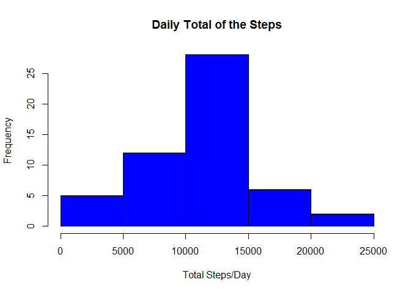
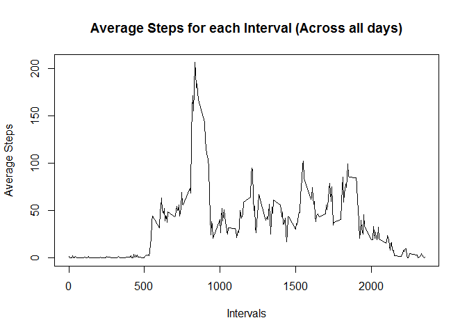
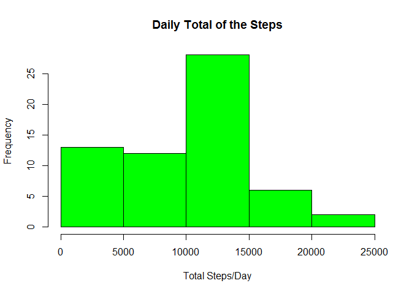
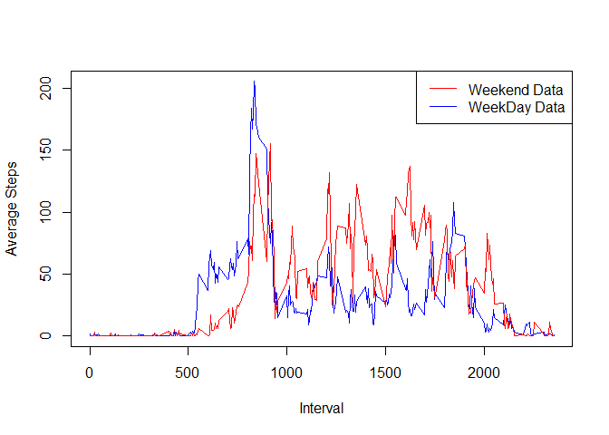

# Reproducible Research: Peer Assessment 1


## Loading and preprocessing the data


This process included the following steps:


 * Importing from user specified csv file to data. 
 * Converting dates from string to date format.
 * Storing poisitions of missing values in a logical vector "dirty" 
 * Storing all non missing rows in cleanData


```r
data <- read.csv(file.choose(),header=TRUE, sep=",", na.strings="NA")
data[,"date"] <- as.Date(as.character(data[,"date"]), "%Y-%m-%d")
dirty = is.na(data[,"steps"])
cleanData <- data[!dirty, ]
```


## What is mean total number of steps taken per day?
In order to find the mean of daily total of steps, number of steps were to be summed up according to the dates.
Following that it was represented as a histogram:


```r
dailyStepSum <- aggregate(steps~date,cleanData,sum)
hist(dailyStepSum[,"steps"], col="blue", main="Daily Total of the Steps", xlab="Total Steps/Day")
```

 

```r
options(scipen=999) # the mean looks weird in scientific notation!

cleanMean = mean(dailyStepSum[,"steps"])
cleanMedian = median(dailyStepSum[,"steps"])
```
The mean and median were found out to be 10766.1886792 and 10765 respectively.


## What is the average daily activity pattern?

The average daily pattern was obtaied by by first generating the aggregate values of mean for every interval and finally plotting them againt the intervals they belong to.


```r
#Mean and Median values are computed for each interval:
intervalStepMean = aggregate(steps~interval, cleanData, mean)
intervalStepMedian= aggregate(steps~interval, cleanData, median)

#Required plot is generated
plot(intervalStepMean[,"interval"], intervalStepMean[,"steps"], type="l",xlab="Intervals", ylab="Average Steps", main= "Average Steps for each Interval (Across all days)")
```

 

```r
#Maximum average (row) is found.
maxStepInterval= intervalStepMean[ intervalStepMean[,"steps"]== max(intervalStepMean[,"steps"]) , ]
```

The maximum interval was 835 with the corresponding average value of 206.1698113.


## Imputing missing values

   In order to make a simplified, yet reasonable guess about what the missing values could've been,
   interval aggregates have been used. It should be noted that the number of steps is strictly an integer type value.
   Therefore substitution by means (which need not be integers) has been avoided.
   Median values for the intervals were used to substitute the missing number of steps. 


```r
imputedData = data

#Following function returns interval median steps for input interval 
medianVal= function(x){ intervalStepMedian[intervalStepMedian[,"interval"]==x,"steps"]}


imputedData[dirty,"steps"] = sapply(data[dirty,"interval"],medianVal )

#If median values were to be assigned directly, they would've automatically been cycled according to the "intervals""
#However, that logic would not be applicable if more columns were present for cycling while the above logic should still work!


newDailyStepSum <- aggregate(steps~date,imputedData,sum)
hist(newDailyStepSum[,"steps"], col="green", main="Daily Total of the Steps", xlab="Total Steps/Day")
```

 

```r
newMean = mean(newDailyStepSum[,"steps"])
newMedian = median(newDailyStepSum[,"steps"])
```


### Consequences of the Substitutions

As one would expect, the mean value changed from 10766.1886792 to
9503.8688525. However, there was also a change in the median from 10765 to 10395 as the basis of substitutions
was the median values of "interval", not the median value of Daily total of "steps" !

## Are there differences in activity patterns between weekdays and weekends?

In order to figure out the differences in patterns between weekdays and weekends, a logical vector (indicating weekend/not) was created.
The corresponding cross-plot was then generated.

```r
#function for sapply which returns TRUE/FALSE:
isWeekEnd = function(x){ rtrn = weekdays(x)=="Saturday"  || weekdays(x)== "Sunday" }

#Logical Vector:
WeekEnd = sapply(imputedData[,"date"], isWeekEnd)

#Aggregated Values:
weekendIntervalMean= aggregate(steps~interval, imputedData[WeekEnd,], mean)
weekdayIntervalMean= aggregate(steps~interval, imputedData[!WeekEnd,], mean)


#Plot
plot(weekdayIntervalMean[,"interval"],weekdayIntervalMean[,"steps"],col="blue",ylab="Average Steps",xlab="Interval",type="l")

lines(weekendIntervalMean[,"interval"],weekendIntervalMean[,"steps"],col="red")

legend("topright", lty=1, col=c("red","blue"), legend=c("Weekend Data","WeekDay Data") )
```

 


##Findings

In the study conducted, the subjects were likely to walk more on weekends for most intervals approximately greater than 1000. The trend was opposite for intervals less than that.
It may be tempting to state that "people tend to walk more in longer durations on weekends", however since more information (like the profession, age group etc.) is not available, this form of data analysis may be too trivail to provide us with such insights. (For example, the step count of an individual whose profession involves a lot of walking could be significantly different.)
